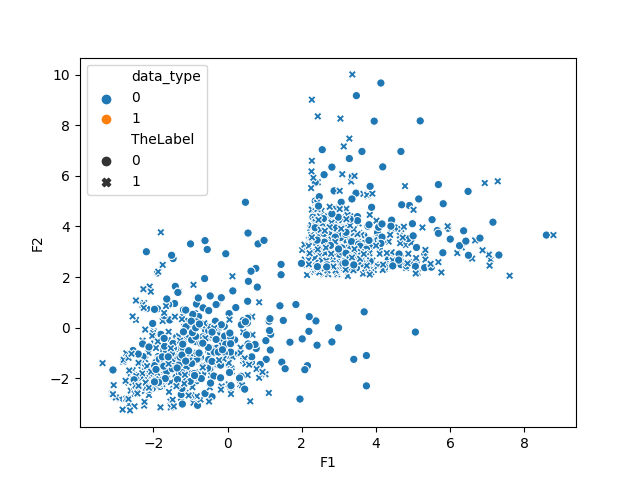
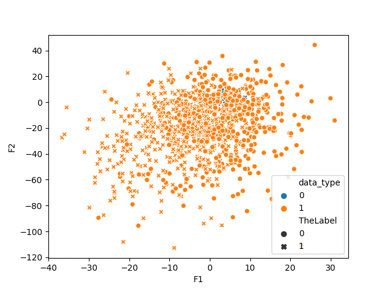
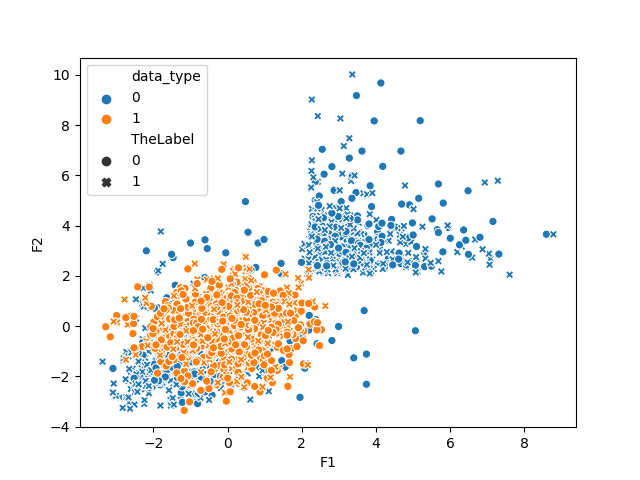
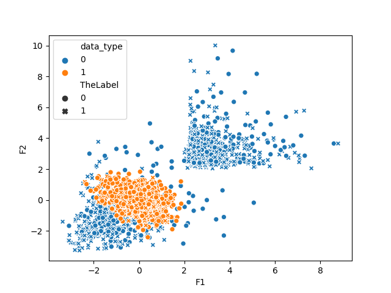
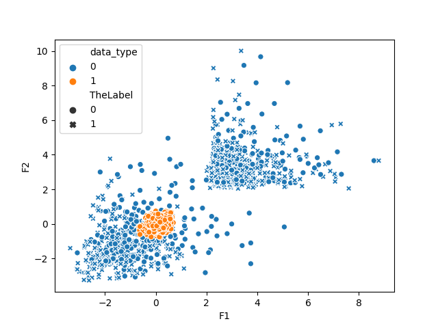
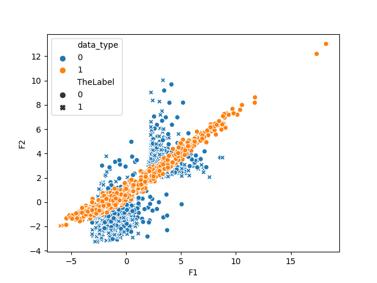

# Generative Adversarial Network (GAN) Example using Keras. 

The goal of this GAN is to generate fake date from a dataset shown below. 

  

This is a shapshot of how the training gradually improves. 

  

The final results are shown below. 

  

A known issue with GAN is mode collapse. 
This is when the generator learns to generate a subset of the real distribution. 

